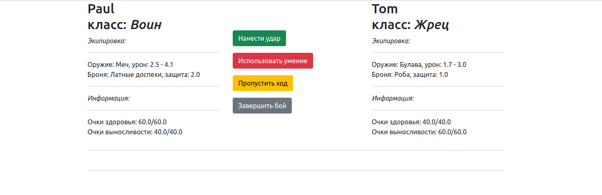

# Battle-Simulator

A small game that allows you to choose two characters for battle. While editing characters, you can give them a name, class, weapons and armor. Each class has individual characteristics and a special skill that it can use once per game.



## Classes

## _Warror_

Characteristic
| Name | Value |
| ------ | ------ |
| Health | 60 |
| Stamina | 40 |
| Attack modifier | 0.8 |
| Stamina modifier | 0.9 |
| Armor modifier | 1.2 |
| Ability | Strong beat (20 dmg, 15 st)

## _Thief_

Characteristic
| Name | Value |
| ------ | ------ |
| Health | 50 |
| Stamina | 35 |
| Attack modifier | 1.5 |
| Stamina modifier | 1.2 |
| Armor modifier | 1 |
| Ability | Insidious blow (15 dmg, 10 st)

## _Priest_

Characteristic
| Name | Value |
| ------ | ------ |
| Health | 40 |
| Stamina | 60 |
| Attack modifier | 0.7 |
| Stamina modifier | 1.2 |
| Armor modifier | 1 |
| Ability | Healing (15 heal, 5 st)

## Requirements

* Python 3.10.6

## Build

Linux & MacOS

1. Create virtual environment

```bash
python3 -m venv venv
```

2. Activate virtual environment

```bash
source venv/bin/activate
```

3. Install requirements

```bash
pip install -r requirements.txt
```

4. Run flask application

```bash
export FLASK_APP=run.py
flask run
```
